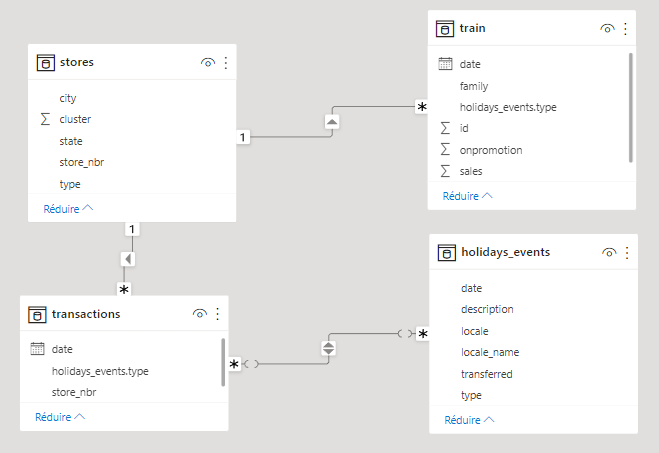

 <h1 style = "display:inline"> 📊 Sales Power BI dashboard </h1>

---

In this repo you will find a dashboard created using Power BI, and Power Query. In this dashboard you can visualize the sales of each store by state, category of the product sold, and by date. You can also explore all transactions that was made to have wide view of the datasets.

## Data

The data used in this repo represent the store sales of a large Ecuadorian-based grocery retailer named Corporación Favorita. You can download the original datasets using this [link](https://www.kaggle.com/competitions/store-sales-time-series-forecasting).

The data are compressed into zip format, if you want to check the data you can extract the files using winrar.

You can also find the data model in the model section of the Power BI Desktop application.

